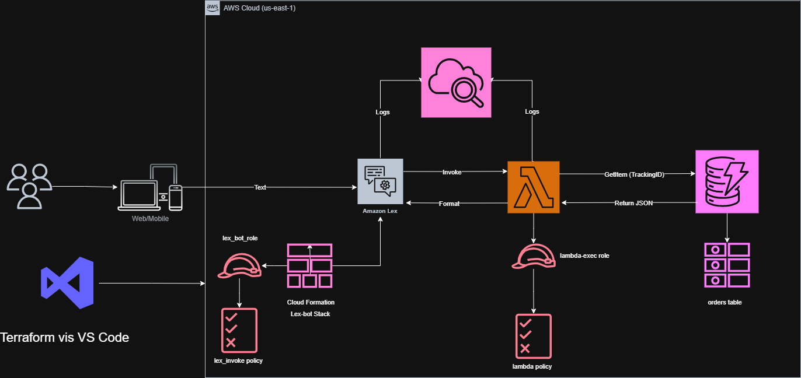

# SwiftLine AI Chatbot

**Assessment:** Solutions Engineer - Jonah Uka

**Project:** Serverless Order Tracking Bot

## Overview
A fully automated AI chatbot architected on AWS to handle logistics order tracking. The solution uses **Amazon Lex V2** for natural language processing, **AWS Lambda** for business logic, and **Amazon DynamoDB** for high-performance data retrieval. The entire stack, including IAM security and CloudWatch observability, is deployed via **Terraform** using a hybrid Infrastructure-as-Code approach.

## Architecture Summary
* **Interaction:** Amazon Lex V2 (Intents: Welcome, GetOrderStatus, EndConversation)
* **Compute:** AWS Lambda (Python 3.12)
* **Storage:** Amazon DynamoDB (On-Demand Capacity)
* **Observability:** Amazon CloudWatch (Conversation Logs & Execution Logs)
* **Security:** IAM Roles implementing Least Privilege.

## Architectural Diagram


## Prerequisites
* AWS CLI installed and configured with appropriate credentials.
* Terraform v1.0+ installed.

## Deployment Instructions

1.  **Clone the Repository**
    ```bash
    git clone <your-repo-url>
    cd swiftline-bot
    ```

2.  **Initialize Terraform**
    Navigate to the infrastructure directory:
    ```bash
    cd terraform
    terraform init
    ```

3.  **Deploy Resources**
    Apply the infrastructure configuration.
    ```bash
    terraform apply -auto-approve
    ```
    *Note: The deployment automatically seeds the DynamoDB table with the sample order data (ID: `SWL-2024-AIR-001234`).*

## Demo Access / Testing Instructions

Since this is a secured backend infrastructure deployment, access is managed via IAM roles. Please follow these steps to test the bot's logic using the AWS Management Console:

1.  Log in to the **AWS Management Console**.
2.  Navigate to the **Amazon Lex** service.
3.  Click on the bot named **SwiftLineBot**.
4.  In the left sidebar, select **Aliases** > **TestBotAlias**.
    * *Note: The `TestBotAlias` is the DRAFT environment used for verification.*
5.  Click the **Test** button to open the chat window.

### Test Script

**Scenario 1: The Guided Menu Flow**
1.  **User:** Type "Hi"
2.  **Bot:** Displays a Welcome Menu. Click the **"Track my Order"** button.
3.  **Bot:** "Please provide your tracking ID..."
4.  **User:** Type `SWL-2024-AIR-001234`
5.  **Bot:** Returns full order details (Status, Items, Customer info) and asks, "Is there anything else?"
6.  **User:** Click the **"No"** button.
7.  **Bot:** Thanks the user and closes the conversation.

**Scenario 2: Direct Intent Query**
1.  **User:** Type "Where is my package?"
2.  **Bot:** Asks for the Tracking ID.
3.  **User:** Type `SWL-2024-AIR-001234`
4.  **Bot:** Returns order details immediately.

## Source Code Structure
* `src/`: Python source code for Lambda fulfillment logic.
* `terraform/`: Terraform configuration files and the embedded CloudFormation template.
* `documentation/`: Architecture diagrams and design rationale documents.